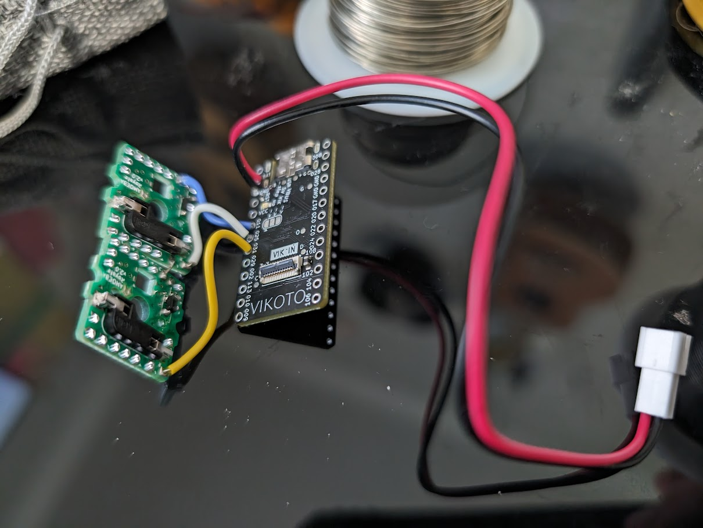
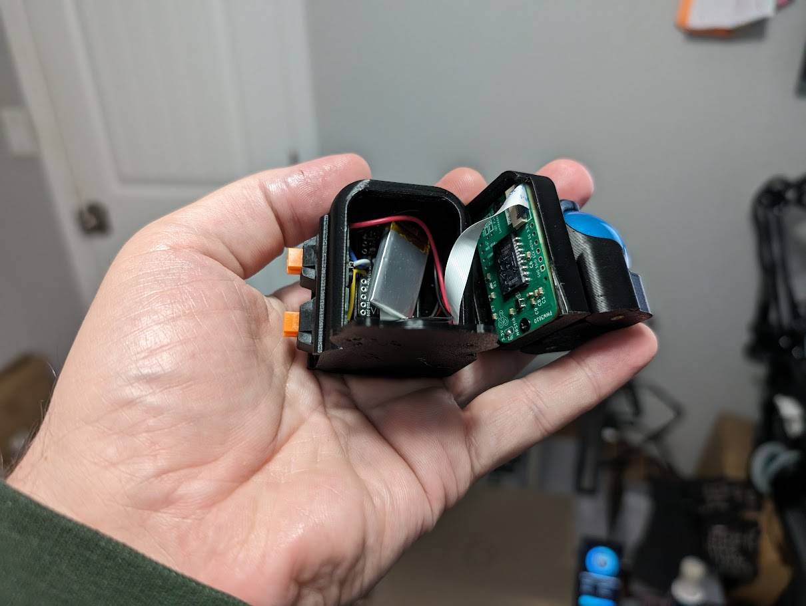
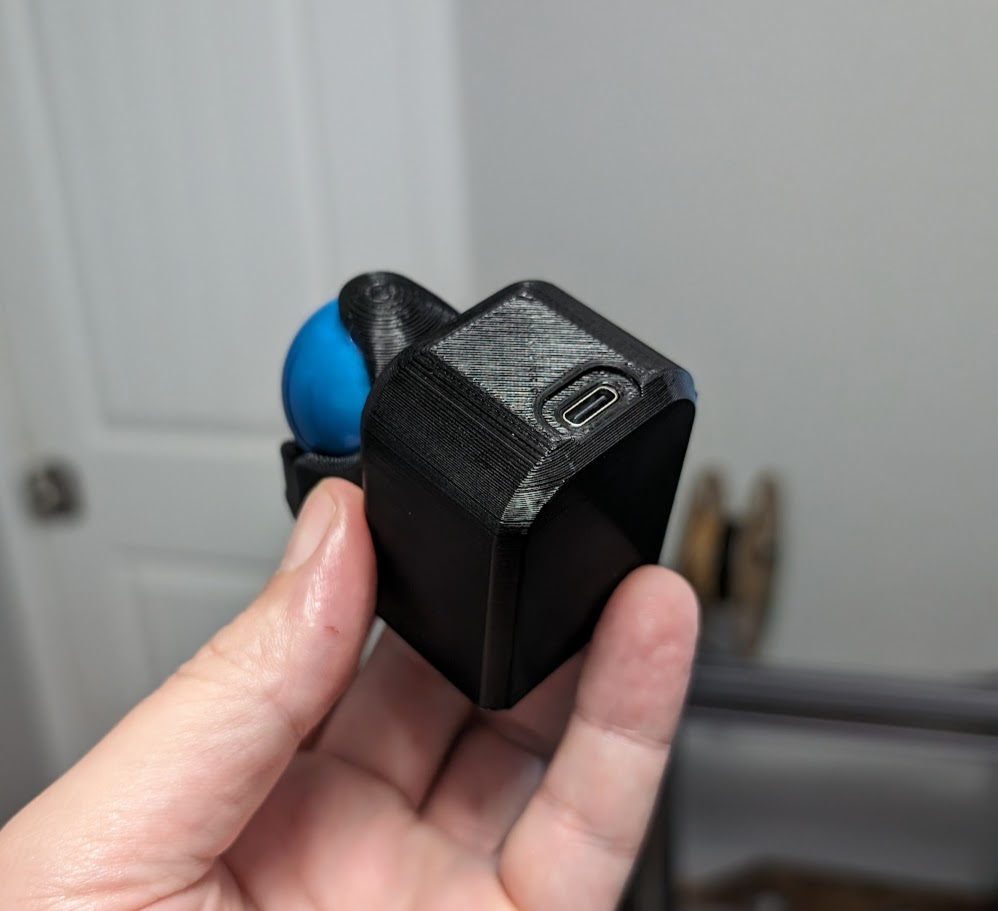

# helmet head

## overview

This is the firmware for a personal build of the trackball thumb helmet:  
https://github.com/sadekbaroudi/fingerpunch/tree/master/3d-models/trackball-thumb-helmet

Specifically, this is a build with the switch cutouts, found here:  
https://github.com/sadekbaroudi/fingerpunch/blob/master/3d-models/trackball-thumb-helmet/trackball-thumb-helmet-vik-controller-optional-battery-backpack-w-switch-cutouts.stl

## wiring

The wiring is as follows:
* Column 0 wired to P0.11
* Row 0 wired to P0.25
* Row 1 wired to P0.35
* Trackball is connected with VIK, using the [vik_pmw3610 shield](https://github.com/sadekbaroudi/zmk-fingerpunch-vik/tree/main/boards/shields/vik_pmw3610)

## images

